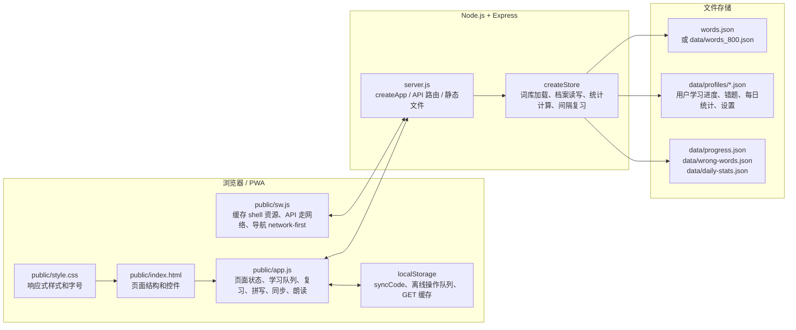
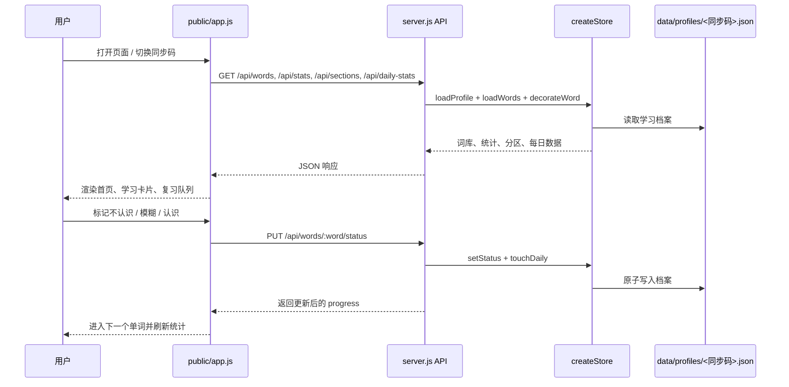
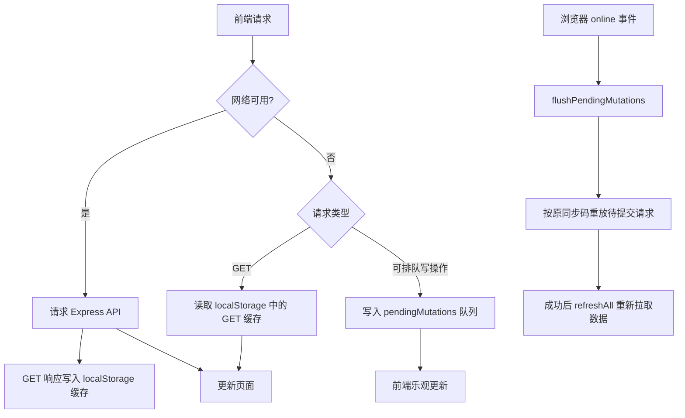
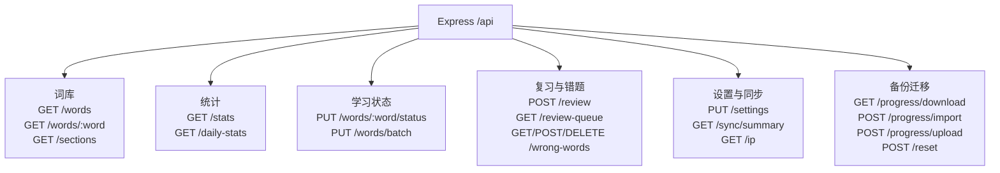

# 中考词汇背诵助手架构图

本文档用 Mermaid 描述应用的主要运行架构、数据流和离线缓存关系。

## 总体架构

```mermaid
flowchart TB
  user[用户<br/>电脑 / 手机浏览器 / PWA] --> ui[前端静态应用<br/>public/index.html<br/>public/app.js<br/>public/style.css]
  ui --> sw[Service Worker<br/>public/sw.js<br/>离线缓存与旧缓存清理]
  sw --> ui
  ui --> tts[浏览器 Web Speech API<br/>单词 / 词性 / 释义 / 例句朗读]
  ui --> storage[浏览器 localStorage<br/>同步码 / GET 缓存 / 离线待提交队列]
  ui --> api[Express API<br/>server.js]
  sw --> api

  api --> store[应用数据层<br/>createStore]
  store --> words[词库文件<br/>words.json 或 data/words_800.json]
  store --> profiles[学习档案<br/>data/profiles/&lt;同步码&gt;.json]
  store --> uploads[导入上传临时目录<br/>data/uploads]

  api --> static[静态资源服务<br/>express.static(publicDir)]
  static --> ui
```

## 前后端职责



## 核心学习数据流



## 离线与同步策略



## 主要 API 分组


